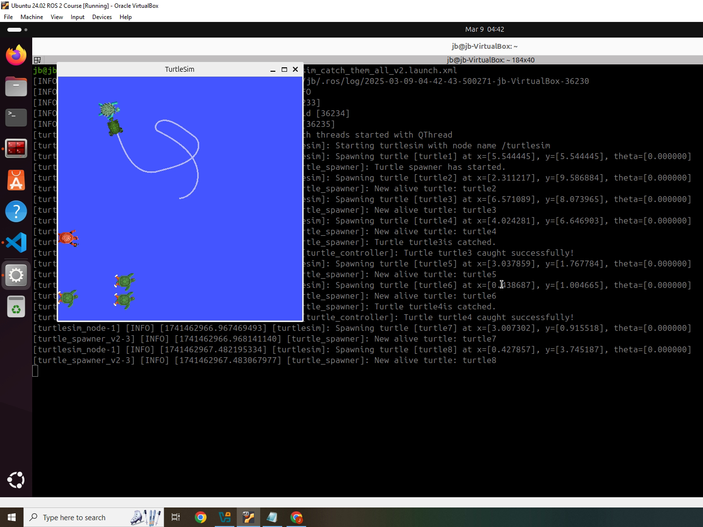

# Turtlesim Catch Them All - ROS2 Project

This project demonstrates how to create and control turtles in the `turtlesim` environment using ROS2. The goal of the project is to spawn, control, and "catch" turtles using services, publishers, and subscribers.

## My Approach

To begin with, I started the project in a "hardcore mode," meaning I directly started on my own without following any instructions step by step (let’s call this the hardcore mode). Below are the steps I took during this initial approach, resulting in the creation of the following files:
- `turtle_controller.py`
- `turtle_spawner.py`

Later, after receiving feedback and instructor notes, I made revisions and improvements. The final versions of the files are:
- `turtle_controller_v2.py`
- `turtle_spawner_v2.py`

## Steps Taken to Create This Project

### 1. **Create Package: `turtlesim_catch_them_all`**

The first step was to create a ROS2 package for managing the turtlesim simulation. The package includes nodes for spawning turtles, controlling them, and interacting with them.

### 2. **Create `turtle_spawner` Node**
This node handles spawning and killing turtles in the simulation.

#### Services:
- **/spawn**: Spawns a new turtle at random coordinates between `0.0` and `11.0` for both `x` and `y`. These coordinates are advertised by the `turtlesim` node.
- **/kill**: Removes a turtle from the screen.
- **/catch_turtle**: Handles the action of "catching" a turtle by calling the `/kill` service.

#### Publisher:
- **/alive_turtles**: Publishes the list of turtles that are alive. This is stored as an array in a custom message.

#### Custom Messages:
- **Turtle.msg**: Contains a list of turtle names.
- **TurtleArray.msg**: Contains a list of turtle coordinates.

### 3. **Create `turtle_controller` Node**
The `turtle_controller` node controls the movement of the turtles based on their positions.

#### Main Features:
- A high-rate control loop (timer).
- Subscribes to `/turtle1/pose` for the current position of the turtle.
- Publishes to `/turtle1/cmd_vel` to control the turtle's movement.
- Subscribes to the `/turtle1/cmd_vel` topic to control the turtle's movement dynamically.
- Selects a target turtle from the list of alive turtles:
  1. First turtle in the array.
  2. Closest turtle to the controller.

### 4. **Create Launch File: `turtlesim_catch_them_all.launch.xml`**
This launch file brings everything together by activating the following nodes:
- `turtlesim_node` (runs the turtlesim environment).
- `turtle_controller` (controls the turtles).
- `turtle_spawner` (spawns and kills turtles).

## Commands & Tools

Here are some useful commands and tools you might use during development:

- **List Services**: `ros2 service list`
- **Show Service Type**: `ros2 service type <service_name>`
- **Show Request and Response**: `ros2 interface show <service_type>`
- **Call Service**: `ros2 service call <service_name> <arguments>`

## How to Start the Project

1. **Build the Workspace**:
   In the `ros2_ws` directory, run the following command to build the workspace:
   ```bash
   colcon build
   source install/setup.bash
   ros2 launch my_robot_bringup turtlesim_catch_them_all_v2.launch.xml

## Results



The image visually demonstrates the functionality of the "Spawn and Catch Simulation" in the final project. It shows multiple turtles being spawned at random positions within the simulation environment. A robot (turtle_controller) is actively chasing these turtles to "catch" them, with the path and movement of the robot being visualized. The image emphasizes key elements like the turtle spawning service, control loop for catching the turtles, and the interaction between different ROS2 nodes, such as the turtle_spawner and turtle_controller nodes. The layout helps to illustrate the dynamics of spawning, controlling, and catching in the simulation environment.

## Notes

Here are some useful commands for working with ROS2 services:

- **ros2 service list**: Lists all available services.
- **ros2 service type <service_name>**: Shows the service type for a specific service.
- **ros2 interface show <interface_name>**: Displays the details of a ROS2 interface.
- **ros2 service call <service_name> <arguments>**: Calls a ROS2 service with the specified arguments.
